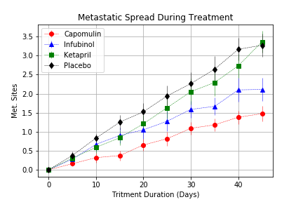
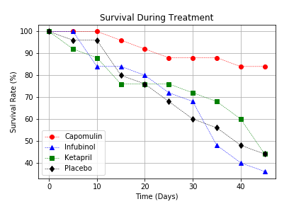
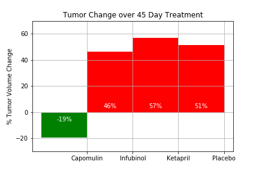
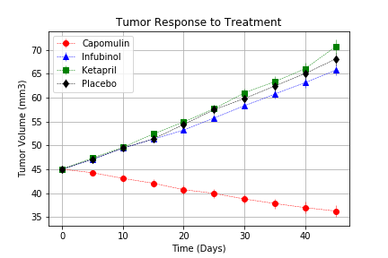

# Pymaceuticals
Analysis and visualization of drug results (Pandas, NumPy, Matplotlib)

Lots of research been done to find a cure for squamous cell carcinoma (SCC), a commonly occurring form of skin cancer. And here I analyze data and visually present results using Pandas and Matplotlib libraries. Several drugs been picked out of all variety and plotted in different charts. Please refer to pymaceuticals.ipynb. Charts been saved as separate graphic files for references. To run locally clone repository, open pymaceuticals.ipynb with Jupyter Notebook and run all cells. Python 3 and libraries (Pandas, NumPy, Matplotlib) needs to be installed. 

